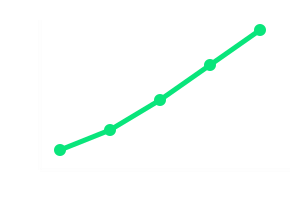
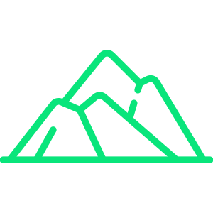
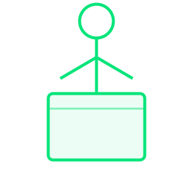
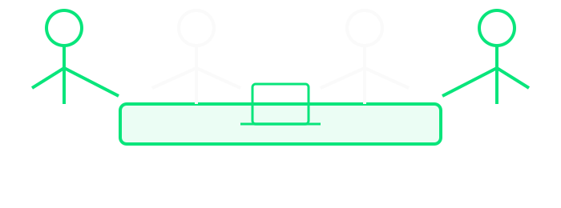
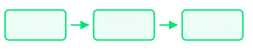
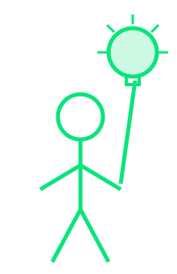
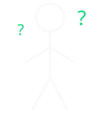
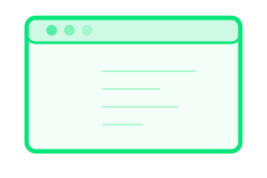

## Basics {#slide-1 background-color="#0a0a0a" .hide-title}

This is some simple content for Slide 1.

This content for all slides can be updated by editing the `index.qmd` file.

It uses the **markdown** markup language, which has a simple syntax for formatting text. The Quarto docs have a good [reference](https://quarto.org/docs/authoring/markdown-syntax.html) for the syntax.


## Images {#slide-2}

You can add images to slides by embedding the image file in the slide content.

{width=500 fig-align="center"}

## Images - Absolute Placement {#slide-3}

You can also place multiple images at precise positions with the `.absolute` class and `top`/`left`/`bottom`/`right` offsets (in pixels, on a 1600 × 900 slide).

{.absolute top=250 left=80 width=380}

{.absolute top=350 left=180 width=380 fig-alt="Line-art mountain range"}

{.absolute bottom=90 right=120 width=360 fig-alt="Line chart trending upward"}


## SVG Graphics {#slide-4}

You can add SVG graphics for line art, like the one below, by referencing an SVG file.


## SatCamp Icons {#slide-5}

::: {.center-v}
{fig-alt="SatCamp icon lockup: hiker, satellite, mountains, bike and globe"}

### Earth observation community
:::

## {#slide-6 background-color="#0a0a0a"}

::: {.center-v}
{fig-alt="Line-art mountain range"}

### Colorado, USA
:::


## {#slide-7 background-color="#0a0a0a"}

::: {.center-v}
{fig-alt="Stick figure standing at a podium"}

### ⚡ 5 minutes to share anything
:::


## {#slide-8 background-color="#0a0a0a"}

::: {.center-v}
::: {.formula}
[20]{.highlight} slides  ×  [15]{.highlight} seconds  =  **5 minutes**
:::
:::


## {#slide-9 background-color="#0a0a0a"}

::: {.center-v}
{fig-alt="A slide with an arrow pointing to a circle containing the number 1"}

### One slide. One idea.
:::


## {#slide-10 background-color="#0a0a0a"}

::: {.center-v}
{fig-alt="Four stick figures gathered around a table with a laptop"}

### 🎤 Show & Tell — no slides required
:::


## {#slide-11 background-color="#0a0a0a"}

::: {.center-v}
{fig-alt="Three boxes labelled demo, questions and iterate connected by arrows"}

### Demo → Questions → Iterate
:::


## {#slide-12 background-color="#0a0a0a"}

::: {.center-v}
{fig-alt="Stick figure pointing up at a glowing lightbulb"}

### Sharing sparks new ideas
:::


## {#slide-13 background-color="#0a0a0a"}

::: {.center-v}


### **[Your hook here]** {.muted}

[Replace this slide with your opening line]{.muted}
:::


## {#slide-14 background-color="#0a0a0a"}


::: {.center-v}
{fig-alt="Stick figure surrounded by question marks"}

### **[The Problem]** {.muted}

[What's broken or missing?]{.muted}
:::


## {#slide-15 background-color="#0a0a0a"}

::: {.center-v}
{fig-alt="Glowing lightbulb"}

### **[The Big Idea]** {.muted}

[Your core insight in one sentence]{.muted}
:::


## {#slide-16 background-color="#0a0a0a"}

::: {.center-v}
{fig-alt="Three numbered circles connected by arrows"}

### **[How It Works]** {.muted}

[Step 1 → Step 2 → Step 3]{.muted}
:::


## {#slide-17 background-color="#0a0a0a"}

::: {.center-v}
{fig-alt="Browser window with placeholder text lines"}

### **[Live Demo]** {.muted}

[Screenshot, GIF, or live walkthrough]{.muted}
:::


## {#slide-18 background-color="#0a0a0a"}

<!-- Slide 17: [Results] — template slide -->

::: {.center-v}
{fig-alt="Line chart trending upward"}

### **[Results]** {.muted}

[One metric that got measurably better]{.muted}
:::


## {#slide-19 background-color="#0a0a0a"}

 Links

[satcamp.xyz](https://satcamp.xyz)
[Past lightning talks](https://satcamp.xyz/#sessions)
[This template on GitHub](https://github.com/satcamp/lightning-talk-quarto-TEMPLATE)


## {#slide-20 background-color="#0a0a0a"}

[Another result, a next step, or a closing thought]{.muted}
:::


## {#slide-applause background-color="#0a0a0a"}

::: {.center-v}
{fig-alt="Two stick figures with arms raised"}

<div class="clap-anim">👏</div>
:::

```{=html}
<script>
document.addEventListener('DOMContentLoaded', function () {
  // Give the title slide a clean URL hash (#/slide-title instead of #/title-slide)
  var ts = document.getElementById('title-slide');
  if (ts) ts.id = 'slide-title';

  // Countdown bar: sits above the RevealJS progress bar, runs right-to-left per slide
  var cdBar = document.createElement('div');
  cdBar.id = 'slide-countdown';
  cdBar.innerHTML = '<div id="slide-countdown-fill"></div>';
  document.querySelector('.reveal').appendChild(cdBar);

  function resetCountdown() {
    var fill = document.getElementById('slide-countdown-fill');
    fill.style.animation = 'none';
    fill.offsetHeight; // force reflow
    fill.style.animation = '';
  }

  Reveal.on('slidechanged', resetCountdown);
  Reveal.on('ready', resetCountdown);
});
</script>
```
